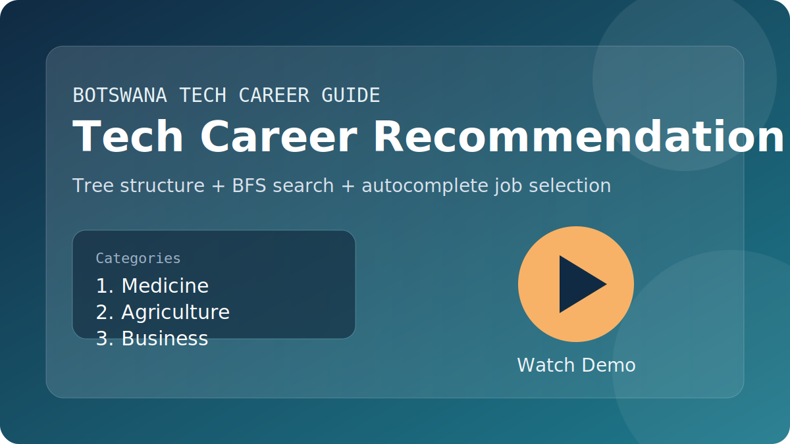

# Tech Career Recommendation Tree

This project is a simple command-line career guidance program that helps a user explore tech-related jobs by category.
NB: This is specific to Botswana only.

## Showcase Video

[](assets/showcase-demo.mp4)

Watch the project demo here: [Showcase Demo](assets/showcase-demo.mp4)

The demo shows:

- the ASCII-art terminal welcome screen
- browsing categories such as Medicine, Agriculture, and Business
- selecting jobs with numbered choices or partial-name autocomplete
- viewing the full job profile, including requirements, workplaces, and salary

The user flow is:
1. View the available categories
2. Choose a category such as `Medicine`, `Agriculture`, or `Business`
3. View all jobs in that category
4. Choose a job
5. See the full details for that job, including requirements, places to work, and salary

## Project Idea

The program uses a tree structure to organise career information.

- The root node is `Tech Careers`
- The next level contains the career categories
- Each category contains job nodes
- Each job node stores the job's details

This makes the project a good example of how trees and traversal algorithms can be used in a real application.

## Features

- Tree-based career organisation
- Breadth-First Search (BFS) to find categories and jobs
- Numbered menus for easier navigation
- Autocomplete-style selection for long job names
- ASCII art banner to make it look nice.

## Categories Included

- Medicine
- Agriculture
- Business

Each category contains tech-related jobs. For example:

- Medicine: Health Informatics Specialist, Biomedical Equipment Technician, Telemedicine Systems Coordinator
- Agriculture: Precision Agriculture Technician, Agricultural Data Analyst, GIS and Remote Sensing Specialist
- Business: Business Intelligence Analyst, FinTech Product Analyst, ERP Systems Specialist

## How BFS Is Used

Breadth-First Search is used to search the tree level by level.

In this project, BFS is used twice:

1. To find the category chosen by the user
2. To find the job chosen by the user inside that category

This matches the structure of the tree and keeps the search logic separate from the display logic.

## Autocomplete Behavior

Some job names are long, so the program does not force the user to type the full title every time.

The user can:

- Enter the number of a category or job
- Enter the exact name
- Enter the first few letters of the name

If there are multiple matches, the program shows matching options and allows the user to refine the input.

## File Structure

- `data.py`
  Stores the raw career data in nested dictionary form.

- `careertree.py`
  Defines the `TreeNode` class, builds the tree, gets category names and job names, and displays job details.

- `bfs.py`
  Contains the Breadth-First Search function used to find nodes in the tree.

- `main.py`
  Runs the full terminal application, displays the ASCII banner, shows categories and jobs, and handles user input.

## Example Program Flow

```text
Available Categories:
1. Medicine
2. Agriculture
3. Business

Choose a category: 1

Jobs In Medicine:
1. Health Informatics Specialist
2. Biomedical Equipment Technician
3. Telemedicine Systems Coordinator

Choose a job: bio

Career Profile: Biomedical Equipment Technician
Description:
  Install, maintain, and repair medical devices used in hospitals, clinics, and laboratories.

Requirements:
  - Diploma or degree in Biomedical Engineering, Electronics, Electrical Engineering, or Medical Equipment Technology
  - Ability to troubleshoot, calibrate, and test medical equipment
  - Knowledge of preventive maintenance, safety checks, and technical documentation
  - Good communication skills for working with doctors, nurses, and suppliers
```

## How To Run

Make sure Python 3 is installed, then run:

```bash
python main.py
```

## Future Improvements

- Add more career categories
- Add university courses linked to each job
- Add a graphical user interface
- Add validation for misspellings and smarter suggestions
- Save user searches or recommendations
- Develop this into a website
- Add more country relevant jobs
- Upgrade it to a machine learning recoommendation system

## Author Notes

This project is designed as both a useful recommendation tool and a practice project for data structures and algorithms.
